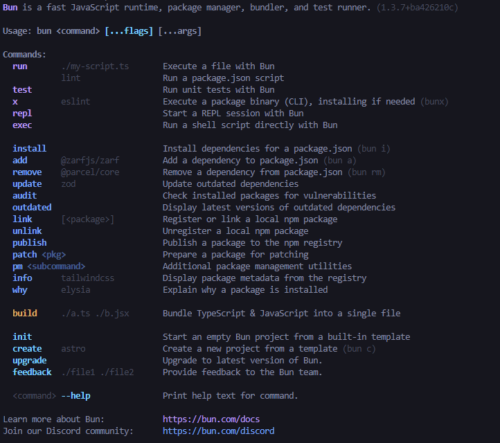
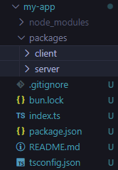

# AI Course

## Rise of AI Engineering

- AI Engineer don't train LLM but use pre-trained LLM to create smarter apps
- AI is being use to create quick takeaway from long threads

### What is a LLM?

- **A system that is trained to understand and generate human language**
- Examples:
  - Commercial:
    - GPT (OpenAI)
    - Gemini (Google)
    - Claude
    - Grok
  - Open-Source Modles
    - Llama
    - Mistral
- LLM are _"Large"_ because they are trained on a large amounts of text, from all source of mediums
- The training teaches these models patterns in a language like:
  - Grammer
  - Tone
  - Common facts
  - Phrasing
- So asking a LLM a question isn't a search for the answer but gives what a helpful response would look like, derived from the training it recieved
  - **Auto-complete on steriods**
- LLM are mathamatical structure made of Billions of parameters, and those parameters represent patterns in language like grammer, facts, tone, and style.
  - These models don't have any real intelligent but are really good at perdicting what comes next.
- All this relies on the data these Models are trained on.
  - If the data is bias, inaccuare, outdated or low-quality then the model will structure its responses off that data.
    - hence some models are politially bias data or confidentlly wrong. **Especially in code**
      - In code it take a large sample of code from across sources like GitHub as data, but most of that code is outdated, messy, or buggy.
        - _It may look professional, but it may not work_
- Training Matters A Lot
  - But the cost to have the hardware infrustructure for such a model is extreamly steep.

### What can you do with Language Models?

- In an applicaiton structure, the LLM is a supporting system that depends on our features
- Some use cases are:
  - Summarization
  - Content Creation
  - Text Classification
    - This can enable us to identify froms of texts and parse that data for our backend to use
  - Translation
  - Data Extraction
    - This can enable us to extract data from texts and parse that data for our backend to use
  - Chat Interfaces
- All these use cases follow the same model: **_Text in Text out_**

### Understanding Tokens and Context Windows

- **Tokens**
  - These are the broken down pieces of text that the LLM uses to understand what a user is trying to say.
    - These aren't the same as characters, and they're not the same as whole words but _something in between_. They can be:
      - Whole words (_Paris_)
      - Parts of words (_engi_ | _neer_)
      - Punctuation
      - Emojis or spaces
      - ~3/4 of a word
        > [OpenAI Tokenizer](https://platform.openai.com/tokenizer)
  - Tokens matter because they determin cost of LLM
- **Context Window**
  - This is the limit of how many tokens a LLM can handle at once.
    - This window includes the:
      - Prompt (_our input_),
      - Model's Response, and
      - The Chat History

### Counting Tokens

- In our applicaiton we can import the **_tiktoken_** library to count our tokens within a prompt before sending it to our model.
  - This allows us to plan for the Model's _Context Window_ and reduce incomplete responses

### Choosing the right Model

- Today, new LLM are being crated weekly so choosing one can be hard.
- The criteria in choosing a model relies on what our application needs.
  - **Don't focus on which models exactly** but on the **criterias** your models needs for your application.
- The list of criterias are listed as such:
  - Reasoning
  - Speed
  - Modalities
  - Cost
  - Context
  - Privacy

- Reasoning
  - More **_complex_** the task use the **_Bigger_** model
  - More **_simple_** the task use the **_Smaller_** model
- Speed
  - **_Faster_** output, use the **_Smaller_** model
  - If **_Slower_** output is ok, use the **_Larger_** model
- Modalities
  - This is the type of meduim you're using (text, images, video or audio)
  - **_Multipe media types_** you'll need a **_LMMs (Large Multi-Modal Models)_**
  - **_Just text_** you'll can use a simple **_LLM_**
- Cost
  - Depends on the cost per token (_usually charged per million_)
    - generating a lot of documents or contetent, cost can add up quickly
- Context Window
  - If you need **_More context_** for the user experiance use a model with a **_Large Context Window_**
  - If **_Less context_** is ok or needed for the user experiance use a model with a **_Smaller Context Window_**
- Privacy
  - If handling **_Private Data_** then its best to use a **_Open-Source, Self-Hosted_** AI
  - If handling **_Private Data_** then its ok to use a **_Comnmercial_** AI
- _Knowledge Cutoff_
  - This is the cutoff date of until when the model has stopped being trained.
  - This may be important to your selection but it isn't the ultimate decision making of the models you choose
    > [OpenAI Models](https://platform.openai.com/docs/models/compare)

### Understanding Model Settings

- In configuring models you can play around with different settings like:
  - **Format**
    - This changes the format of the response
      - Text; json_object; json_schema
  - **Temprature**
    - this is how crative the model can be
      - we never use extream values because the model can be a little too wild in its response
      - For more **_logical, precise_** answers use: **0.2 - 0.4**
      - For more **_Creative_** answers use: **0.7 - 1.0**
  - **Max Tokens**
    - This is the amount of tokens our resopnse will be made up of.
    - This can control cost
      - if we don't need to generate large responses, we don't need to have a large token max
      - but if we use too low of a max token value, our responses can get cutoff
        - thats why our prompts will need to be more specific, and even dictate how long it needs to be
  - **Top P**
    - This is another random generator based on the list of possible next words to use.
      - Each word in this list is given a value, and the Top P value can determin how many of those words can be used as possible next words.
    - We usually change Temprature or Top P, but never both.
      - Safe rule of thumb is to leave Top P at 1, and change Temprature to your liking.
  - _Store Logs_
    - This is simply storing all the logs for debuggin purposes
    - Logs showcase everthing from the prompt and response, to the settings the model used

### Calling Models

- In our application we can call our AI Models by importing a AI client
  - For OpenAI, we install `npm i openai`
  - Then we configure the client with our api key:

  ```javascript
  // your AI api key goes here
  const OPENAI_API_KEY = process.env.API_KEY;

  // configure your ai client here
  const client = new OpenAI({
    apiKey: OPENAI_API_KEY,
  });
  ```

  - After we need to configure our model we're going to use in our applicaiton:
    - In this block of code `stream` is a property of our model that enables the **_Async Iterable_** output that we are so use to seeing in AI chat resposnes
      - without it it will ouput a singular object with our full response from our model.
    - Thus, a list of objects will, one-by-one, be generated as an output into your constant `stream` similar to adding objects into an array.

  ```javascript
  // configure you model here
  const stream = await client.responses.create({
    model: "gpt-4.1",
    input: "Write a story about a dragon",
    temperature: 0.7,
    max_output_tokens: 250,
    stream: true,
  });
  ```

  - To output the response like modern AI Chat bot we will need to `process.stdout.write()` the data (_for console output_)
    - However, the Async Iterable `stream` would need to be looped through and discected for the value of the token that needs to be printed.
    - Thus, we loop through the response tokens and write them to the console like so:

  ```javascript
  for await (const event of stream) {
    if (event.delta) process.stdout.write(event.delta);
  }
  ```

## Full-Stack for Course

### Prerequisite for course

- We'll be using 3 main tools and frameworks:
  - Bun
  - Vite
  - Express
  - Tailwind
  - shadcn/ui
  - Husky

### Setting up Bun

- Modern JS runtime
  - Kinda like Node.JS but faster and more integrated
  - Node.JS requires multiple tools for multiple features, Bun we get all the features of said tools in one tool

  | Node.js                                          | Bun                   |
  | ------------------------------------------------ | --------------------- |
  | npm (tool to run packages)                       | Runtime               |
  | ts-node (tool to run TypeScript)                 | Package Manager       |
  | nodemon (tool to restart the server upon change) | Task Runner           |
  |                                                  | Typescript Transpiler |

- Installing Bun (_on Windows_)
  - In the terminal run this command `powershell -c "irm bun.sh/install.ps1 | iex"` (_from `https://bun.sh/` as of 1.27.2026_)
    - doesn't matter if powershell or cmd terminal
  - Then close all terminal and code editor, reopen, and type Bun in terminal to check if installed.
    - A list of commands will appear.



### Creating Project Structure

- To create a project, using Bun, we want to run: `bun init` in the directory we want to hold our app in
- Once you init the project a question will appear:
  - ```
    Select a project template
        Blank // This is used in this part of the course
        React
        Library
    ```
- Once project is initilized a few files are created:
  - .gitignore
  - index.ts
  - tsconfig.json (for editor autocomplete)
  - README.md

- Bun has a feature called "**_Workspace_**," which lets us manage multiple sub-projects like a client and a server application from a single place.
  - _Also avaliable in Node.js_
- By **Workspace** convention, we put all our sub-projects a directory called "_Packages_"
  - and sub-directories for our client app, and another for our server app



- After adding our directories, we have to declare our _Workspaces_ in our `package.json` file
  - ```json
    "...":{...},
      "workspaces":[
        "packages/client",
        "packages/server"
        // "packages/*" this syntax can be used to refer to all directories in the packages direrectory as workspaces
      ]
    ```

### Creating the Backend

- Init another Bun project within the `server` directory in your `packages` directory of your main project
  - After running `bun init` from `packages/server` folder you see `node_modules` folder on the **root** and **server** folder levels, but the server’s `node_modules` folder is technically **NOT** a real location of your installed dependencies. The dependencies are still located on the root level. After you install any dependency, check out the `packages/server/node_modules` folder you’ll see that it contains only **_symbolic links_** that refer to the **root node_modules** folder.
    - > It use to be that there was only one `node_module` directory at the root Bun project, but now you see them in each workspace package.
  - to install packages in Bun you'll need to run a command as:
    ```cmd
      C:\Users\my-app\packages\sever> bun add <package-you-want-to-install>
    ```
- In the `package.json` directory you can set up scripts to change your applicaiton start command (origionally was: `bun run index.ts`) and even set up new ones for different enviornment like a dev or test enviorment.
  - ```json
      // server>package.json

       "scripts": {
          "start": "bun run index.ts",
          "dev": "bun --watch run index.ts"
        },
    ```

- Install your framework like **Express.js**
  - ```cmd
      C:\Users\my-app\packages\sever> bun add express
    ```
- In your new Bun application, your new server, you want configure your environment variables.
  - Save your environment variables, like your OpenAI API Key, in a `.env` file in your `server` directory and make sure it can be called into your server applicaiton

    ```javascript
    //client>src>App.tsx

    import express from "express";

    const app = express();
    const port = Bun.env.PORT || 3000;

    app.get("/", (req, res) => {
      res.send(Bun.env.OPENAI_API_KEY + "!");
    });
    ```

  - > Bun handles environment variables automatically, but will take the system set variables over anthing else. To gain more control over your variables you can install (add) dotenv and config what file you want to gather your environment variables from.

### Createing the Frontend

- In the `client` directory you'll need to install **Vite** (_Or another frontend build tool or framework_) to create a **React** application.
  - ```cmd
    C:\Users\my-app\packages\client> bun create vite .
    ```

    - This command makes the React applicaiotn within the client directory
      - remove the `.` at the end to make a whole new directory

  - Once you create your React app, you can test the run command:
    - ```cmd
      C:\Users\my-app\packages\client> bun run dev
      ```

### Starting Both Apps at once!

- Since it is tedious to start the server and the client separatlly in two different terminals. Lets do it at the same time!
- At the **full project's root** install concurrently:
  - ```cmd
      C:\Users\my-app> bun add -d concurrently
    ```
  - This library allows us to start multiple applications using a single command
  - 

- Once installed we need to configure the concurrent run script.
  - ```javascript
    // my-app>index.ts

    import concurrently from "concurrently";

    concurrently([
      {
        name: "server",
        command: "bun run dev",
        cwd: "packages/server",
        prefixColor: "yellow",
      },
      {
        name: "client",
        command: "bun run dev",
        cwd: "packages/client",
        prefixColor: "blue",
      },
    ]);
    ```

    ```json
    // my-app>package.json
        "scripts": {
          "dev": "bun run index.ts"
        },
    ```

- After the scripts are configured, we can run the `bun run dev` command and get something like this:
  
  - > The names and colors are set within the `concurrently()` script and are nicely labled within your terminal when running.
